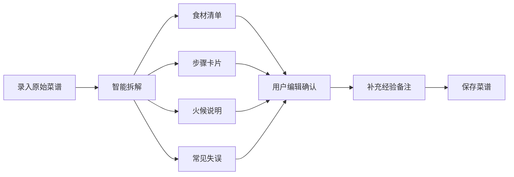

## 1. 产品概述

手写菜谱复原与家宴分工协同系统，将长辈的手写菜谱或口述做法转化为标准化做菜卡，同时保留"凭经验判断"的备注说明。支持家宴筹备时的用量自动换算与家庭成员分工协作，做完后可记录复盘，沉淀家的味道。

- 核心价值：传承家传菜谱、降低家宴筹备复杂度、提升家庭协作效率
- 目标用户：喜欢在家做饭、筹办家庭聚会的用户，尤其是想保留长辈菜谱的年轻人
- 解决痛点：手写菜谱难以标准化、家宴分工混乱、用量换算麻烦、好味道难以复现

## 2. 核心功能

### 2.1 用户角色
| 角色 | 注册方式 | 核心权限 |
|------|---------|---------|
| 普通用户 | 本地使用，无需注册 | 菜谱管理、步骤卡整理、家宴分工、复盘记录、统计查看 |

### 2.2 功能模块
1. **菜谱复原页**：录入手写/口述菜谱，自动拆解为食材、火候、步骤、常见失误的标准化卡片
2. **步骤卡整理页**：查看和编辑所有菜谱的步骤卡片，调整顺序、补充备注
3. **家宴分工页**：选择菜品、设置人数、自动换算用量、给家庭成员分配洗切/备料/掌勺/摆盘任务
4. **复盘记录页**：记录口味偏差、下次调整建议，关联到对应菜谱
5. **统计页**：高频家宴菜、各步骤耗时分布、最易出错环节、家庭成员协作完成率

### 2.3 页面详情
| 页面名称 | 模块名称 | 功能描述 |
|---------|---------|---------|
| 菜谱复原页 | 菜谱录入表单 | 菜名、来源（长辈口述/手写拍照文字描述）、原始做法文本输入 |
| 菜谱复原页 | 智能拆解预览 | 将原始做法拆解为食材清单、步骤卡片、火候说明、常见失误、经验备注 |
| 菜谱复原页 | 菜谱列表 | 已保存的菜谱卡片展示，支持搜索和筛选 |
| 步骤卡整理页 | 步骤卡瀑布流 | 所有菜谱的步骤卡片，支持拖拽排序 |
| 步骤卡整理页 | 步骤卡编辑器 | 编辑单张步骤卡的食材、火候、时长、注意事项 |
| 家宴分工页 | 菜品选择器 | 从菜谱库中选择本次家宴的菜品 |
| 家宴分工页 | 人数换算 | 设置用餐人数，自动等比例换算所有食材用量 |
| 家宴分工页 | 任务分配板 | 家庭成员卡片 + 洗切/备料/掌勺/摆盘四个任务列，拖拽分配 |
| 家宴分工页 | 任务清单 | 按角色汇总的任务清单，支持勾选完成 |
| 复盘记录页 | 复盘表单 | 选择菜谱、记录口味偏差、下次调整建议、整体评分 |
| 复盘记录页 | 复盘时间线 | 按时间展示历史复盘记录 |
| 统计页 | 高频菜品排行 | 柱状图展示最常做的家宴菜品 TOP 10 |
| 统计页 | 步骤耗时分布 | 饼图/环形图展示各步骤（洗切/备料/烹饪/摆盘）耗时占比 |
| 统计页 | 易错环节分析 | 条形图展示最容易出错的步骤环节 |
| 统计页 | 协作完成率 | 雷达图/柱状图展示各家庭成员的任务完成率 |

## 3. 核心流程

### 3.1 菜谱复原流程
用户录入长辈的手写菜谱文字描述或口述内容 → 系统按食材、火候、步骤时机、常见失误四个维度拆解 → 生成标准化做菜卡片 → 用户确认并补充"凭经验判断"的备注 → 保存到菜谱库

### 3.2 家宴筹备流程
创建家宴活动 → 从菜谱库选菜 → 设置用餐人数 → 系统自动换算用量 → 给家庭成员分配任务 → 按清单执行 → 完成后复盘记录

## 4. 用户界面设计

### 4.1 设计风格
- **主色调**：暖橙色 (#E87A3F) - 代表温暖、食物、家的味道
- **辅助色**：米白色背景 (#FFF8F0)、深棕文字 (#3D2B1F)、鼠尾草绿 (#7BA05B) 代表新鲜食材
- **按钮风格**：圆润饱满，微立体阴影，hover 有轻微上浮效果
- **字体**：标题使用有手写感的衬线字体（如 "Noto Serif SC"），正文使用清晰易读的无衬线字体（如 "Noto Sans SC"）
- **布局风格**：卡片式布局，模拟菜谱卡片的质感，轻微纸张纹理背景
- **图标风格**：线条圆润的手绘风格图标，配合食材、厨具等元素

### 4.2 页面设计总览
| 页面名称 | 模块名称 | UI 元素 |
|---------|---------|---------|
| 菜谱复原页 | 录入区 | 大输入框 + 拆解按钮，卡片式拆解结果展示 |
| 步骤卡整理页 | 卡片列表 | 瀑布流/网格布局，卡片有纸张质感，支持拖拽 |
| 家宴分工页 | 任务看板 | 四列看板布局，成员头像卡片，拖拽分配 |
| 复盘记录页 | 时间线 | 左侧时间轴 + 右侧复盘卡片 |
| 统计页 | 图表区 | 温暖配色的图表卡片，网格布局 |

### 4.3 响应式
- 桌面端优先设计，适配 1440px 及以上
- 平板端：网格列数自适应减少
- 移动端：单列布局，底部导航栏切换
- 触控优化：按钮最小 44px，拖拽区域有视觉反馈

### 4.4 动效与交互
- 页面加载：卡片渐入 + 轻微上浮，错落有致
- 卡片悬停：阴影加深 + 轻微放大
- 拖拽交互：被拖拽元素半透明，目标区域高亮
- 任务完成：勾选时有弹性动画 + 轻微庆祝效果
- 数据切换：图表有平滑过渡动画
