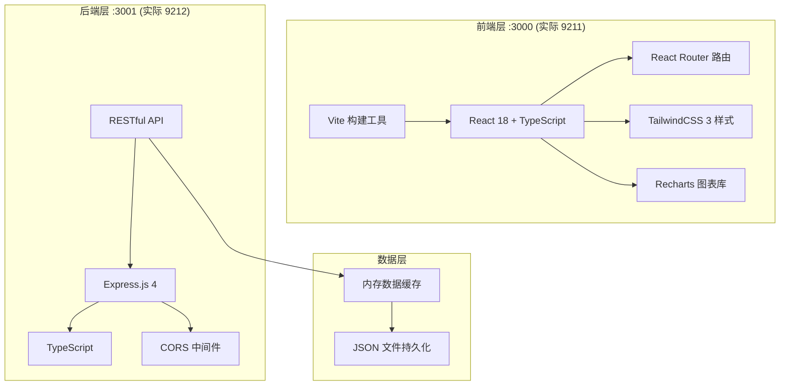
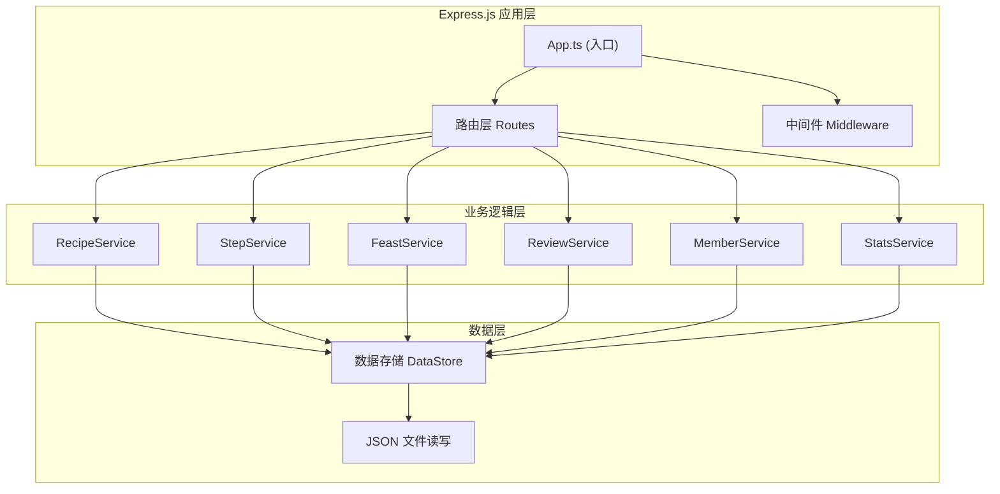
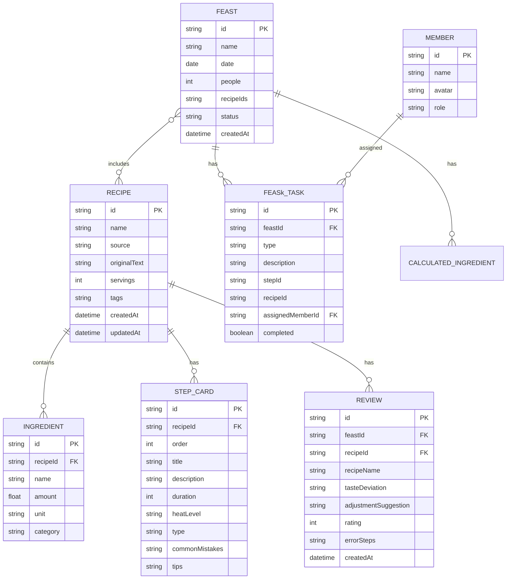

## 1. 架构设计



## 2. 技术说明

- **前端**: React@18 + TypeScript + Vite + TailwindCSS@3 + React Router v6 + Recharts
- **初始化工具**: Vite (npm create vite@latest)
- **后端**: Express@4 + TypeScript + CORS
- **数据库**: JSON 文件持久化 + 内存缓存（轻量级，无需额外数据库服务）
- **前端端口**: 9211
- **后端端口**: 9212

## 3. 路由定义

| 前端路由 | 页面名称 | 说明 |
|---------|---------|------|
| / | 菜谱复原页 | 菜谱录入、拆解、列表展示 |
| /steps | 步骤卡整理页 | 所有步骤卡片查看与编辑 |
| /feast | 家宴分工页 | 选菜、换算、任务分配 |
| /review | 复盘记录页 | 复盘表单与历史记录 |
| /stats | 统计页 | 数据可视化统计图表 |

## 4. API 定义

### 4.1 菜谱相关 API

| 方法 | 路径 | 说明 | 请求体 | 响应体 |
|------|------|------|--------|--------|
| GET | /api/recipes | 获取所有菜谱 | - | Recipe[] |
| GET | /api/recipes/:id | 获取单个菜谱详情 | - | Recipe |
| POST | /api/recipes | 创建新菜谱 | CreateRecipeRequest | Recipe |
| PUT | /api/recipes/:id | 更新菜谱 | UpdateRecipeRequest | Recipe |
| DELETE | /api/recipes/:id | 删除菜谱 | - | { success: boolean } |
| POST | /api/recipes/parse | 智能拆解菜谱文本 | { text: string, name: string } | ParsedRecipe |

### 4.2 步骤卡相关 API

| 方法 | 路径 | 说明 | 请求体 | 响应体 |
|------|------|------|--------|--------|
| GET | /api/steps | 获取所有步骤卡 | - | StepCard[] |
| GET | /api/steps/:id | 获取单个步骤卡 | - | StepCard |
| PUT | /api/steps/:id | 更新步骤卡 | UpdateStepRequest | StepCard |
| PUT | /api/steps/reorder | 重排步骤顺序 | { recipeId, order: string[] } | StepCard[] |

### 4.3 家宴相关 API

| 方法 | 路径 | 说明 | 请求体 | 响应体 |
|------|------|------|--------|--------|
| GET | /api/feasts | 获取所有家宴记录 | - | Feast[] |
| GET | /api/feasts/:id | 获取单个家宴详情 | - | Feast |
| POST | /api/feasts | 创建家宴 | CreateFeastRequest | Feast |
| PUT | /api/feasts/:id | 更新家宴 | UpdateFeastRequest | Feast |
| DELETE | /api/feasts/:id | 删除家宴 | - | { success: boolean } |
| POST | /api/feasts/calculate | 计算用量 | { recipeIds: string[], people: number } | CalculatedIngredient[] |

### 4.4 复盘相关 API

| 方法 | 路径 | 说明 | 请求体 | 响应体 |
|------|------|------|--------|--------|
| GET | /api/reviews | 获取所有复盘记录 | - | Review[] |
| POST | /api/reviews | 创建复盘记录 | CreateReviewRequest | Review |
| GET | /api/reviews/recipe/:recipeId | 获取某菜谱的复盘 | - | Review[] |

### 4.5 家庭成员 API

| 方法 | 路径 | 说明 | 请求体 | 响应体 |
|------|------|------|--------|--------|
| GET | /api/members | 获取所有家庭成员 | - | Member[] |
| POST | /api/members | 添加家庭成员 | { name: string, avatar?: string } | Member |
| PUT | /api/members/:id | 更新成员信息 | { name: string, avatar?: string } | Member |
| DELETE | /api/members/:id | 删除成员 | - | { success: boolean } |

### 4.6 统计 API

| 方法 | 路径 | 说明 | 请求体 | 响应体 |
|------|------|------|--------|--------|
| GET | /api/stats/overview | 获取统计概览 | - | StatsOverview |
| GET | /api/stats/popular-dishes | 高频菜品排行 | - | { name: string, count: number }[] |
| GET | /api/steps/time-distribution | 步骤耗时分布 | - | { type: string, avgMinutes: number }[] |
| GET | /api/stats/error-prone | 易错环节分析 | - | { step: string, errorCount: number }[] |
| GET | /api/stats/member-completion | 成员完成率 | - | { memberId: string, name: string, completionRate: number }[] |

### 4.7 TypeScript 类型定义

```typescript
// 食材
interface Ingredient {
  id: string;
  name: string;
  amount: number;
  unit: string; // 克、毫升、个、勺等
  category: 'main' | 'seasoning' | 'side';
}

// 步骤卡
interface StepCard {
  id: string;
  recipeId: string;
  order: number;
  title: string;
  description: string;
  duration: number; // 分钟
  heatLevel: 'low' | 'medium' | 'high' | 'none'; // 火候
  type: 'prep' | 'wash-cut' | 'cooking' | 'plating'; // 步骤类型
  commonMistakes: string[];
  tips: string; // 经验备注
  ingredients: string[]; // 涉及的食材 ID
}

// 菜谱
interface Recipe {
  id: string;
  name: string;
  source: string; // 来源，如"奶奶口述"
  originalText: string; // 原始做法文本
  servings: number; // 基准份量（几人份）
  ingredients: Ingredient[];
  steps: StepCard[];
  tags: string[];
  createdAt: string;
  updatedAt: string;
}

// 拆解结果
interface ParsedRecipe {
  name: string;
  ingredients: Ingredient[];
  steps: Omit<StepCard, 'id' | 'recipeId'>[];
  commonMistakes: string[];
  tips: string;
}

// 家庭成员
interface Member {
  id: string;
  name: string;
  avatar?: string;
  role?: string;
}

// 家宴任务
interface FeastTask {
  id: string;
  type: 'wash-cut' | 'prep' | 'cooking' | 'plating';
  description: string;
  stepId?: string;
  recipeId?: string;
  assignedMemberId?: string;
  completed: boolean;
}

// 家宴
interface Feast {
  id: string;
  name: string;
  date: string;
  people: number;
  recipeIds: string[];
  ingredients: CalculatedIngredient[];
  tasks: FeastTask[];
  status: 'planning' | 'in-progress' | 'completed';
  createdAt: string;
}

// 换算后的食材
interface CalculatedIngredient {
  name: string;
  amount: number;
  unit: string;
  category: string;
  sourceRecipes: string[];
}

// 复盘记录
interface Review {
  id: string;
  feastId?: string;
  recipeId: string;
  recipeName: string;
  tasteDeviation: string; // 口味偏差
  adjustmentSuggestion: string; // 下次调整建议
  rating: number; // 1-5 分
  errorSteps: string[]; // 出错的步骤 ID
  createdAt: string;
}

// 统计概览
interface StatsOverview {
  totalRecipes: number;
  totalFeasts: number;
  totalReviews: number;
  totalMembers: number;
}
```

## 5. 服务器架构图



## 6. 数据模型

### 6.1 数据模型 ER 图



### 6.2 数据存储格式

所有数据存储在 `backend/data/` 目录下的 JSON 文件中：

- `recipes.json` - 菜谱数据
- `members.json` - 家庭成员数据
- `feasts.json` - 家宴记录数据
- `reviews.json` - 复盘记录数据

初始数据包含示例菜谱、家庭成员和家宴记录，便于演示。
